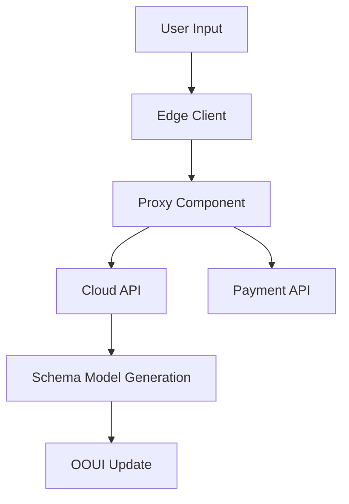

# INVARCH Technical Design: OOUI and Payment Infrastructure

## **1. Overview**
INVARCH provides the following components as part of its decentralized software design:

1. **OOUI (Object-Oriented User Interface)**:
   - A dynamic and flexible UI design that includes payment UI.
   - Operates on edge clients and integrates with cloud components.

2. **Payment Infrastructure**:
   - Managed either within INVARCH packages or as an external project.
   - Provides APIs for international payments and data sharing.

3. **Edge Clients and Proxy Components**:
   - Functions as lightweight proxies on the client side, communicating with multiple APIs.
   - Facilitates efficient integration with cloud components.

4. **Real-Time Communication Infrastructure**:
   - Communication between clients and edge clients (React Server Component) is unified under Partial Hydration.
   - API interactions and communication are handled on the clstg (Cluster Gateway).

---

## **2. Component Structure**

### **2.1 OOUI**
#### **Design Goals**
- Reusable and extensible UI components.
- Integration of design and data models with real-time updates.

#### **Key Technologies**
- **Frontend Frameworks**: React, Next.js.
- **Styling**: TailwindCSS, Emotion.
- **UI Construction Tools**: Storybook.
- **Design Sync**: Figma Sync Server.

#### **Key Features**
1. **Dynamic UI Rendering**:
   - Components dynamically generated based on schema models.
2. **Payment UI**:
   - Components visualizing payment flows.
   - Real-time updates via API integration.
3. **Figma Integration**:
   - Real-time synchronization and unified design management.

---

### **2.2 Payment Infrastructure**
#### **Design Goals**
- Support international payments in decentralized environments.
- Provide secure and extensible APIs.

#### **Key Technologies**
- **Blockchain**: Ethereum, Polygon.
- **Smart Contracts**: Solidity.
- **Backend Frameworks**: Node.js, Express.
- **Databases**: PostgreSQL (transaction management), Redis (caching).

#### **Key Features**
1. **Token-Based Payments**:
   - Automates payment processing with smart contracts.
2. **API Integration**:
   - Integrates with payment services (e.g., Stripe, PayPal).
3. **User Management**:
   - Supports KYC (Know Your Customer) and AML (Anti-Money Laundering) compliance.

---

### **2.3 Edge Clients and Proxy Components**
#### **Design Goals**
- Enable efficient communication between clients and the cloud.
- Abstract API integrations and ensure secure communication.

#### **Key Technologies**
- **Communication Protocol**: Partial Hydration.
- **Frameworks**: React Server Component.
- **Cloud Services**: AWS Lambda, Google Cloud Functions.

#### **Key Features**
1. **Proxy Functionality**:
   - Receives API requests from clients and forwards them to appropriate backend services.
   - Consolidates multiple APIs into a single endpoint.
2. **Security Features**:
   - Encrypts traffic (TLS 1.3).
   - Token-based authentication (JWT).
3. **Real-Time Synchronization**:
   - Facilitates data exchange with cloud components.

---

## **3. Data Flow Overview**

### **Explanation**
1. The user performs actions on the client side (e.g., entering payment information).
2. The edge client uses Partial Hydration to forward API requests to the appropriate services.
3. The cloud API generates schema models and updates the OOUI in real-time.
4. Payment API is engaged as needed to process transactions.

---

## **4. Project Segmentation and Integration**

### **4.1 Role Within INVARCH**
- **OOUI**:
  - Integrated within INVARCH, managing design-to-implementation workflows.

### **4.2 External Project for Payment Infrastructure**
- **Reasoning**:
  - Managing the payment infrastructure as an independent project ensures flexibility and extensibility.
  - Facilitates integration with other projects.

### **4.3 API Integration Design**
- **Endpoint Design**:
  - /api/payment/initiate
  - /api/payment/status
  - /api/payment/history
- **Authentication and Authorization**:
  - OAuth 2.0-based authentication.
  - User-specific scope management.

---

## **5. Next Steps**
1. **Prototype Development**:
   - Build fundamental OOUI components and edge client functionalities.
2. **Detailed Payment Infrastructure Design**:
   - Select blockchain platforms and design smart contracts.
3. **Integration Testing Environment Setup**:
   - Validate communication between client, proxy, and cloud APIs.
4. **Implementation of Partial Hydration Communication Infrastructure**:
   - Prototype and optimize communication models between clients and edge clients.
5. **Design of Decentralized Data Sharing Infrastructure**:
   - Trial implementation using IPFS or Filecoin for distributed storage.
